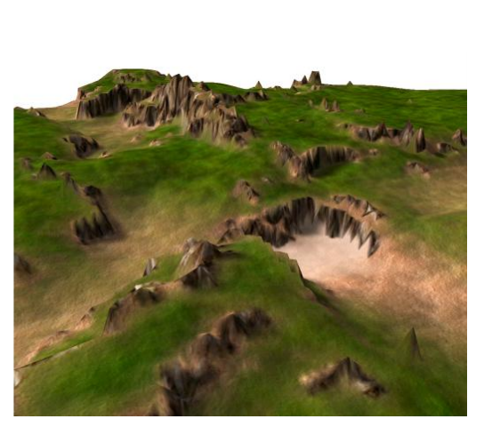
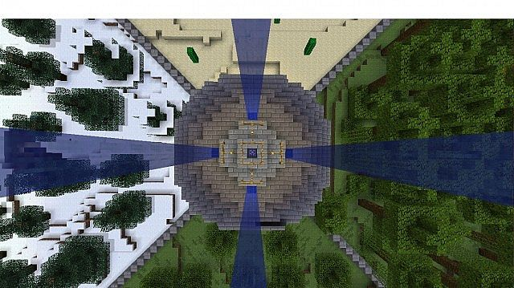
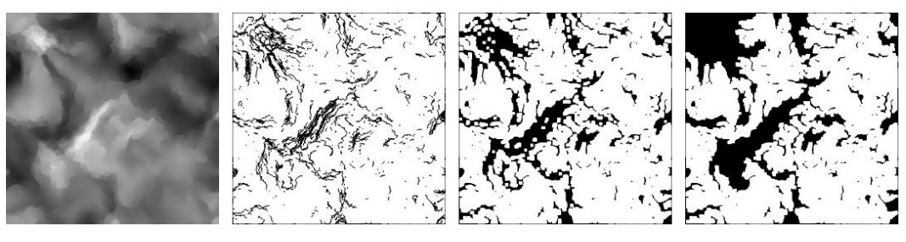

# TerrainEngine
Terrain generation engine built in Unity. For Boise State CS 497 - Advanced Computer Graphics.

A Trello task list can be found here: https://trello.com/b/A6eJpKhz/terrain-engine

# Goals

### Overview
The goal of this project is to develop a real-time procedural terrain generator that implements multiple fractal-based techniques, including fractal-noise heightmap generation, hydraulic and thermal erosion, and biome partitioning. The project is developed using Unity to allow for user interaction and dynamic model placement along the procedurally generated terrain.

### "Stitched" Heightmap Generation

The primary way that we’ll use to generate geometry is by generating fractal-based heightmaps that are indexed on a cartesian coordinate system. In other words, given several heightmaps arranged like this:  
▢ ▢ ▢  
▢ ▢ ▢  
▢ ▢ ▢  
… each heightmap will seamlessly connect via their respective noise-spaces. In addition, new adjacent heightmaps will use previous heightmap information to start off. Each newly created heightmap is used to create a “block” of geometry that is procedurally placed in the world.

### Biome Partitioning

In addition to creating simple noise-based heightmaps in “blocks”, the nature of these noise-spaces may change depending on what type of biome they may be mapped to. As these heightmaps are generated, the world-space will also detect what sort of biome a region of a heightmap should depict. In other words, a mountainous region may have more rugged space while a beach region may be smoother and feature bodies of water. This will also make for a great opportunity to experiment with material blending on these pieces of geometry, in addition to procedural placement of 3D models on top of the generated terrain.

### Heightmap Generation Approach

I believe that achieving these effects will be most effective in parts. This is what I believe my sequence of tasks to handle should include:

-	Create prefab pieces of geometry that read in heightmap information to generate vertex positions
-	Procedurally spawn these pieces of geometry based on proximity and viewport
-	Use fractal-based algorithms to generate heightmaps that seamlessly connect to each other
-	Use large, procedurally-generated textures to “partition” regions into biomes (like mountains, fields, and rivers)
-	Blend materials together on geometry based on heightmap deltas and biome regions
-	Use prefab models to place objects on geometry based on biome regions

As I work on this project, my tasks will likely be more complex, but I feel that this is a good set of goals to start off with.

# Log

### 2/14/2020 - Setup for Mesh Placement + Heightmap Generation Setup

In this update, I created a new prefab object that generates MeshGenerator objects in a grid formation. In addition, the MeshPlacer generates indexed heightmaps that the MeshGenerators read in order to generate their geometry. Currently, only random RGB values are generated for the corners of the ((2^n) + 1)-sized heightmaps. However, in future updates, I will be using the diamond-square algorithm and other permutations to generate smooth noise fields for each MeshGenerator object that connect to other MeshGenerator object heightmaps. In addition, I will set up the MeshPlacer script to add new MeshGenerator objects based on vicinity and the viewport of the player character. 

### 2/7/2020 - Basic Terrain Grid

In this update, I created a new 3D Unity project with a single empty object called a "MeshGenerator". It contains a Mesh Filter and Mesh Renderer subcomponent, in addition to a Mesh Generator C# script, which is where vertices and triangles are actually generated. This script creates a mesh and assigns it to the MeshFilter subcomponent of the object, and then calls a CreateShape() method. This method first creates a Vector3 array of size "(x + 1) * (y + 1)" called "vertices", then programmatically fills it with Vectors x and z values aligned in a grid, while y values are assigned using a Perlin Noise function. Another integer array called "triangles" keeps track of vertex indices generated in the "vertices" array. This array programmatically assigns the correct vertices together to create triangles with back-face culling. Once both arrays are generated, the mesh data is cleared, assigned with new vertices and triangles, and the RecalculateNormals() method is called to properly light the mesh.
